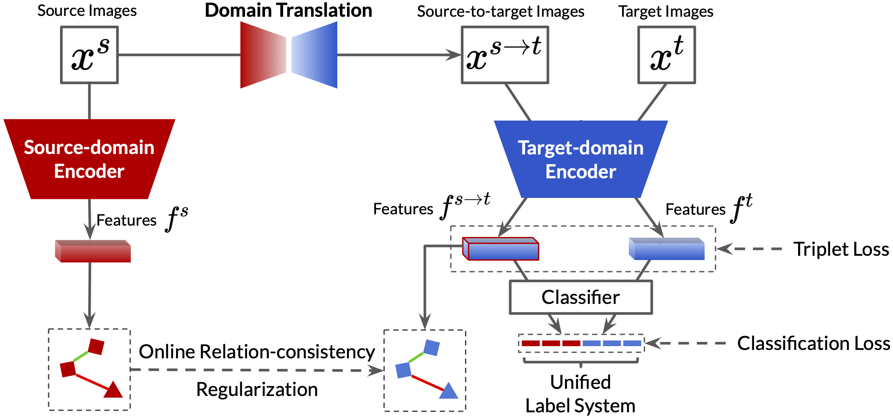

# Structured Domain Adaptation (SDA)

[[Paper]](https://arxiv.org/abs/2003.06650) [[Project]](https://yxgeee.github.io/projects/sda.html)

This repository contains the implementation of [Structured Domain Adaptation with Online Relation Regularization for Unsupervised Person Re-ID](https://arxiv.org/abs/2003.06650)



We are still sorting out the codes of SDA, which will be released later.

## Citation
If you find this work useful for your research, please cite our paper
```
@misc{ge2020structured,
    title={Structured Domain Adaptation for Unsupervised Person Re-identification},
    author={Yixiao Ge and Feng Zhu and Rui Zhao and Hongsheng Li},
    year={2020},
    eprint={2003.06650},
    archivePrefix={arXiv},
    primaryClass={cs.CV}
}
```
